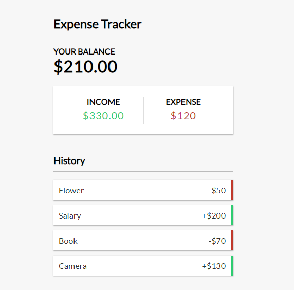

# Project Title

This repo is the part of my front-end development journey. I have practiced this project to see the Traversy Media youtube video. In this project a user can track his/her expense and income.

## Demo

Insert gif or link to demo

## Lessons Learned

-   Context APi
-   useState
-   useReducer
-   map function
-   reduce function
-   filter function

## Screenshots

## Tech Stack

**Client:** HTML, CSS, Javascript, React

## 🚀 About Me

I'm a front-end developer with backend knowledge.

## 🛠 Skills

**Front-end** : Javascript, React, Next.js, HTML, CSS, Bootstrap, Tailwind, SASS, SVG, GSAP

**Aditional Backend** : Node.js, Express.js, MongoDB, MySQL

## Acknowledgements

-   [Build an Expense Tracker | React Hooks & Context API](https://www.youtube.com/watch?v=XuFDcZABiDQ)
